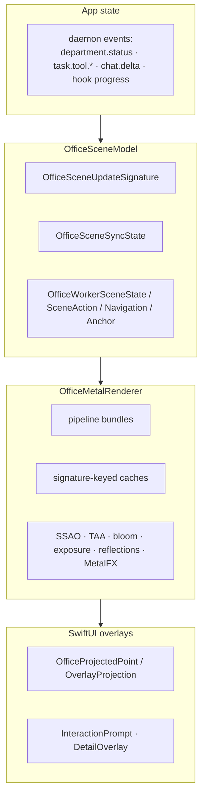

# M29 · Office Renderer

**Source:** 264 `Office*` Swift types, `default.metallib` (32 `office_*` shader entry-point names), GLB/USDZ/HDR
assets, `sf_downtown_osm_environment.json`, `office_post_processing.json`

Full detail in [docs/08-office-3d-world.md](../docs/08-office-3d-world.md). This page is the
module-level contract.

---

## Purpose

Render the company as a place and synchronize scene content with agent state. 60 fps is a possible target, not a measured result in this dossier.

## Layer contract



`OfficeSceneUpdateSignature` and cache-key names suggest avoiding redundant scene/texture rebuilds. No Swift bodies establish the exact gate, and unchanged app state does not imply zero GPU work. Animation, camera motion and temporal effects can still render. Relevant names:

```
OfficeWorkerScreenTextureSignature        worker monitor content
OfficePresentationPanelTextureSignature   presentation panel content
OfficeDepartmentSignCacheKey              department sign text
OfficeVacantWorkstationCacheKey/SlotKey/AgentKey   desk allocation
OfficeStaticSceneCacheKey                 static environment
OfficeCityResourceCacheKey                city geometry
OfficePixelTextMaskCacheKey               in-world pixel text
OfficeVoiceSceneSignature                 voice HUD state
```

## Adaptive load

```
OfficeRenderQualityProfile / Tier
OfficeAdaptiveSceneLoadProfile → adaptiveLoadLevel: Int
OfficeMetalRendererGPUPressure → RuntimePressureEvaluation
OfficeMetalFXMode / Upscaler
```

Under pressure the renderer reduces **scene content**, not just resolution — `adaptiveLoadLevel`
is a parameter to the city generator.

## Entity mapping

| Domain entity | Scene entity |
|---|---|
| Department | a room, a carpet material, a corner sign, a folder cluster |
| Worker (running session/agent) | a VRM character at an allocated workstation |
| Worker output | a texture on its monitor |
| Department artifact | a folder object (`folder-single.glb`) |
| Skill | a book on `skill-shelf.glb` |
| Department message | a "flight" pulse between rooms |
| Live session / voice | HUD + participant rows + visitor banner |
| Objective/dashboard | a presentation panel in the boardroom |

## Behaviour system

```
OfficeWorkerSceneActionKind → ResolvedWorkerActionKind
OfficeWorkerNavigation (Waypoint, TravelMode, SeatMode) → ResolvedNavigation
OfficeWorkerConversation / ConversationFocus / ConversationSnapshot
OfficeBoardroomMeetingState
OfficeAvatarReactionKind / Request / Sound / ClickState
OfficeFirstPersonState / CollisionBlocker / PoolArea
AgentMindService / AgentMindState / AgentPersonality (mood, energy, traits)
```

Persona state (`agent_minds.<ws>.json`) drives display behaviour only **[V]**: the daemon bundle — the only place prompts are assembled — contains zero references to `agent_minds`, `agentMinds` or `AgentMind` (`grep -c` over `neo-agent.fmt.js`), and the file is written by `Matrix/AgentMindService.swift` on the client. Presentation persona never reaches a model in Matrix; keeping it separate is therefore recovered behaviour, not just a proposed rule.

## Cost / substitution

| Sub-layer | Build or buy |
|---|---|
| VRM parsing + skinning | **buy** — three-vrm, or an engine |
| Renderer + post-FX | **buy** — R3F / Godot / RealityKit |
| City generation | **skip** — a stylised abstract set suits a studio better |
| Anchors / desk allocation | **build** — product logic |
| Worker behaviour state machine | **build** — product logic |
| Live content as texture | **build** — this is the magic |
| Signature gate | **build** — estimate after defining invalidation and animation requirements |

## Reuse in shotgun-next

Build a **studio floor**, not an office tower: a small stylised space with a desk per role, a
review wall where deliverables hang, a reference board, and a table for critique rounds.

Keep from Matrix: the signature gate, the entity mapping table, live content as texture, 2D
overlay projection from 3D anchors, and persona-for-display separated from persona-for-prompt.
