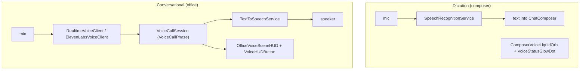

# M30 · Voice & Presence

**Source:** `LiveKitWebRTC.framework`, `RustLiveKitUniFFI.framework`, `ElevenLabs.bundle`,
`RealtimeVoiceClient`, `ElevenLabsVoiceClient`, `VoiceCallSession/Phase`,
`SpeechRecognitionService`, `TextToSpeechService`, `Office{Live,Voice}*`,
`focus.broadcast` / `activity.broadcast`

---

## Purpose

Talk to the company, and let other people visit it.

## Configuration

```
Info.plist:
  MATRIX_VOICE_PROVIDER          = "elevenlabs"
  MATRIX_ELEVENLABS_AGENT_ID     = ""        (blank in this build)
  MATRIX_ELEVENLABS_ENVIRONMENT  = ""
Entitlement: com.apple.security.device.audio-input
TCC: NSMicrophoneUsageDescription, NSSpeechRecognitionUsageDescription
```

## Two voice paths



The conversational path has **two selectable providers [V]** (client strings, `docs/08` §7.1):
`NEO_/MATRIX_VOICE_PROVIDER = "elevenlabs"` routes to an ElevenLabs Conversational-AI agent
(`NEO_/MATRIX_/ELEVENLABS_AGENT_ID`, `…_ENVIRONMENT`) whose transport is the ElevenLabs SDK's
`WebRTCConnectionManager` over LiveKit; any other value routes `RealtimeVoiceClient` to
`NEO_/MATRIX_REALTIME_WS_URL`, default `wss://matrix.agent.space/v1/realtime?model=gpt-realtime-2`.
The ElevenLabs agent is instructed to answer trivia directly and to call exactly one client tool,
`call_neo_intelligence(user_request)`, for anything that touches Matrix state — so the voice
layer never holds authority of its own. End-to-end behaviour and permission handling remain
untested here; the blank agent identifiers mean the ElevenLabs path needs runtime configuration.

## Multiplayer

LiveKit is linked (Swift SDK over a Rust UniFFI core), but its **only identifiable consumer is
the ElevenLabs SDK** — no first-party `*LiveKit*` source file exists in the recovered list and the
daemon has zero LiveKit references. The live-workspace feature is modelled differently
(`docs/08` §7.2): a `WorkspaceLiveRoom` (`hostUserID · sceneDescriptor · descriptorVersion ·
maxParticipants · expiresAt · revokedAt · inviteURL`), `WorkspaceLiveParticipantPresence`
(`sequence`-numbered), `WorkspaceLiveInteractionEvent` (whiteboard), and photo-frame descriptors
carrying Supabase Storage paths and signed URLs. Join is a `matrix://live/join/<token>` deep
link ("Join 3D Workspace by URL"), requires sign-in, and is gated — the client ships *"Live
workspaces are unavailable in this build."*

```
OfficeLivePanelView · OfficeLiveParticipantRow · OfficeLiveStatusPill
OfficeLiveVisitorSceneBanner / SceneContext · OfficeVisitorSnapshot
OfficeLivePlayDeck / PlayAction / PlayActionLabel / InteractionKind
OfficeLocalLiveInteraction / LocalInteractionKind
HubMatrixBrowserSession, HubService.broadcastFocus/broadcastActivity
```

These symbols, plus the room/presence/whiteboard record types above, establish the *shape* of the feature. They do not prove a second person can successfully join in this build — that depends on the remote release gate **[U]**.

## Presence protocol

```
focus.broadcast        which department the user is looking at
activity.broadcast     lastActivityMs — idle detection
```

`presence.update` and `read.marker` are absent from the declared daemon registry. Focus/activity are real methods; any mapping to remote voice/visitor signaling needs separate evidence.

## Reuse in shotgun-next

**Keep dictation** — high value, low cost, and creatives talk more than they type.

**Keep conversational voice for review sessions** — "walk me through the cut" is a natural
studio interaction, and `VoiceCallPhase` + a scene HUD is most of the work.

**Defer multiplayer** until there is a second user. But keep `focus.broadcast` from day one: it
is cheap, it improves autonomy targeting, and it is the hook multiplayer later plugs into.
