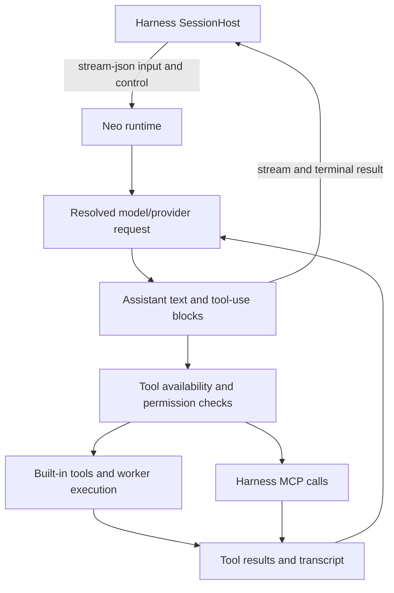

# M31 · Neo Intelligence Runtime

This subsystem was missing from the original module index despite accounting for most of the recovered JavaScript. It is distinct from the harness SessionHost. The bundle includes runtime implementation, third-party packages and embedded assets; 615,762 formatted lines are not original TypeScript source or a buildable repository.

## Process Contract

The harness's `buildCliArgs` (`neo-agent.fmt.js:66044`) supplies `-p --verbose --output-format stream-json --input-format stream-json --replay-user-messages`, plus model, directory, tools, permission and persistence options. Control requests include `can_use_tool` (`65425`); MCP SDK servers are registered on the harness side (`85897`). Runtime input/output is not the client daemon WebSocket protocol.

This is a static control-flow summary; provider transport branches, compaction, retries and worker lifecycles require separate tests when choosing a replacement engine.

## Tool Coverage

The harness supplies 29 built-in names, but a configured name is not proof of availability on every OS/account/runtime. Tools have their own schema getters, `isEnabled`, permissions, calls and result mappers. See [recovered tool definitions and schema binding candidates](../_analysis/audit/runtime-tools-reference.md) and [machine-readable locations](../_analysis/audit/runtime-tools.json). Dynamic factories remain source expressions, not evaluated universal schemas.

| Runtime responsibility | Evidence / boundary |
|---|---|
| Tools and context | harness options at `neo-agent.fmt.js:130641`; not equivalent to implementing an engine from a model API |
| TaskCreate/Get/Update/List storage | `neo-intelligence.fmt.js:203232` resolves list identity and JSON files beneath runtime `tasks/`; durable bytes, separate from OKR |
| TodoWrite | `337398` updates app-state todos, separate from task-list files |
| Verifier message | conditional text at `337422`, `396790`; inspected producers set the activating flag false, so no active 3-task gate is proven |
| Edit permission | `467165` checks rules and paths; `493128` can add session allow rules for Neo folders |
| Same-owner workers | Agent tool runtime/context/isolation choices; external runtimes do not inherit every Neo context mode |
| Transcripts | runtime session identity and harness canonical-transcript repair must agree; bytes on disk and visible user history are different layers |
| Provider routing | host environment controls the configured route, but a complete hosted gateway implementation is not in this bundle |

## Replacement Requirements

A usable adapter needs streaming text/reasoning/tool results, correlated tool call IDs, cancellation, permissions, resume, compaction, worker isolation, usage reporting and error classification. Declare supported capabilities per adapter. Do not send Neo-specific flags, `preset:"studio"` or renamed environment variables to another CLI and assume they work.

The reconstruction choices are: use a supported external agent runtime with its documented contract, or implement the missing model/tool loop. This audit does not choose a vendor or validate current vendor contracts. Do not treat extracted Matrix binaries, prompts, fonts or assets as automatically redistributable application dependencies; retain them as local reference evidence and track replacement/licensing decisions separately.
