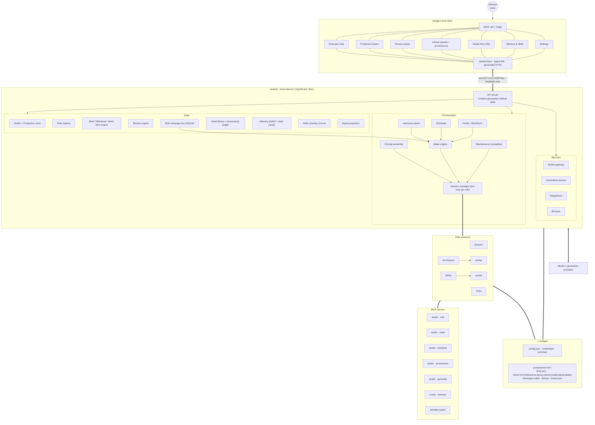

# shotgun-next · Target Architecture

---

## 1. System



## 2. Process model

Proposed lifecycle, subject to implementation and recovery tests:

- **Client spawns the daemon as a supervised child** with a PID lease. Losing the lease drains
  the daemon.
- One persistent role/session identity; processes may start on demand, retire and resume. Bound active concurrency and separate lead processes from temporary workers.
- **Loopback-only bind**, with a single explicit env override and a hard refusal otherwise.
- **Preflight → reconcile → reap orphans → serve → drain → shutdown budget → force-kill.**

Copy the lifecycle phases verbatim; they are cheap and they prevent an entire class of
"why is there a zombie agent" bug.

## 3. Filesystem contract

```
~/.shotgun/
├── config.json              production registry
├── credentials/             (Keychain-backed; JSON only as a fallback)
├── runtimes/<kind>/{current,config-home}
├── daemon/{sock,status.json,owner.json,daemon.log}
├── projects/                transcripts
└── productions/<productionId>/
    ├── brief.json           the Brief (direction layer)
    ├── config.json          role registry + primary pointer + schemaVersion
    ├── RULES.md             studio-wide standing instructions
    ├── board.json           derived — do not edit
    ├── timeline.json        derived — do not edit
    ├── memory/knowledge/    studio belief cards + style cards + index.md
    ├── skills/
    ├── library/             assets (uploads, generated, imported) + .ledger
    ├── messages.sqlite
    ├── roles/<roleId>/
    │   ├── RULES.md
    │   ├── milestones.json  Milestones owned by this role
    │   ├── items/*.md       Work Item packets
    │   ├── memory/knowledge/
    │   ├── skills/
    │   ├── deliverables/    this role's output (variant sets live here)
    │   ├── trace.jsonl
    │   ├── tmp/             TMPDIR for this role's processes
    │   ├── .runtime/        skill overlays, sessions
    │   └── .studio/         wake-runs/, nudge-decisions/, schedule.json
    └── .studio/             ledger, hooks.jsonl, freshness
```

Rules inherited from Matrix and worth restating:

- Production roots hold **production state, not harness manuals**.
- Directories are **flat** under `roles/`; hierarchy is logical via `parentRoleId`.
- Authoritative managed state must be outside agent-writable storage. The tree above describes readable logical records, not permission enforcement. Use one daemon-owned transactional store and export read-only Markdown/JSON projections; agents work in writable artifact/tmp directories. Do not make exported packets a second write authority.
- Enforce a process/storage boundary covering shells, workers and downloads; refusing Write/Edit paths alone is insufficient.
- `TMPDIR` selects a temporary directory; it does not create a sandbox.

## 4. Transport

```
WebSocket  ws://127.0.0.1:<port>/ws   JSON frames, schema-generated
HTTP       same origin                 asset streaming with Range
UNIX sock  control plane
```

**Single schema source of truth**: define every method, request, response and event in one
TypeScript schema package (zod). Generate the daemon's validator, the client's types, and the
docs from it. Matrix exposes 259 Hub-prefixed names that, by every indicator recovered from the binary, were written by hand on both sides (see M27) — the drift risk this decision removes is real in the original.

## 5. Event taxonomy

Three streams, kept separate (Matrix's best structural decision on the client side):

| Stream | Examples | Consumed by |
|---|---|---|
| **Conversational** | `chat.delta`, `chat.message` | chat bubbles |
| **Work** | `item.tool.start/end`, `item.reasoning`, `item.progress` | board cards, stage cards, 3D avatars |
| **Invalidation** | `roles.changed`, `work.changed`, `library.changed` | refetch |

## 6. Runtime adapters

One interface, three implementations:

```ts
interface RuntimeAdapter {
  start(ctx: RoleContext): Promise<Handle>
  send(handle: Handle, input: Input): Promise<void>
  interrupt(handle: Handle): Promise<void>
  refresh(handle: Handle, ctx: RoleContext, policy: "now"|"defer"): Promise<RefreshStatus>
  close(handle: Handle): Promise<void>
  events(handle: Handle): AsyncIterable<RuntimeEvent>
}
```

Implementations are proposed: `native`, `claude_code`, `codex`. A model API is not an agent runtime: the first adapter still needs a model/tool loop, persistence, cancellation, permissions and workers. No reusable Matrix source project or replacement SDK has been recovered. The escalation
policy is the same argument Matrix makes: default native, escalate only when you can **name a
concrete benefit for this specific task**.

## 7. Layer boundaries (the rules that keep it honest)

1. **Agents write source facts. The daemon writes projections.** Board and timeline are derived.
2. **Tools own state; file tools cannot touch it.**
3. **The host captures provenance**, not the agent.
4. **The scheduler owns cost; the model owns judgment.**
5. **Display persona never enters the prompt.**
6. **Maintenance sessions are tagged and stripped from user transcripts.**

## 8. Recovery Contract

Persist intent and stable operation IDs before launching work. Keep completed, failed, cancelled and outcome-unknown distinct. On restart, query provider state before replaying an external write. A reconnect fetches a snapshot and cursor; ordered events carry daemon epoch and sequence. Receipt, runtime completion, reviewed artifact and user delivery are separate facts. See [implementation contracts](10-implementation-contracts.md).
