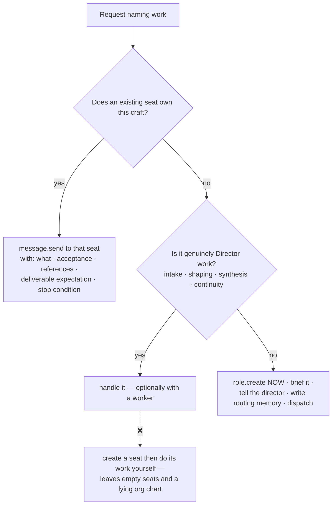

# shotgun-next · Role System

The studio's org model. Directly adapted from Matrix's department registry
([M03](../modules/M03-department-registry.md)), with creative seats instead of business units.

---

## 1. Role record

```ts
interface Role {
  id: string                    // 8 hex
  name: string                  // "Art Director"
  craft: string                 // one-line operating identity, injected into the prompt
  parentRoleId?: string         // logical only; directories stay flat
  // production.primaryRoleId is the single primary pointer; do not duplicate it here
  lifecycle: { status: "active" | "retired" | "merged",
               successorRoleId?, reason?, updatedAt? }
  model?: { provider, model, explicit?, reasoningEffort?, serviceTier? }
  proactive?: boolean

  profile: {
    charter: string             // what this seat is responsible for
    capabilities: {
      writing?:  "primary" | "supporting" | "none"
      visual?:   "primary" | "supporting" | "none"
      motion?:   "primary" | "supporting" | "none"
      research?: "primary" | "supporting" | "none"
      coding?:   "primary" | "supporting" | "none"
      domains: string[]         // ["art-direction","style-locks","image-direction"]
    }
    collaborationBoundary: {
      keepLocal: string[]
      handoffToRole: string[]
      createChildRole: string[]
    }
    taste?: {                   // NEW — the studio-specific extension
      influences: string[]      // named references this seat works from
      avoid: string[]           // hard nos
      styleLockIds: string[]    // locks this seat authored or must honour
    }
  }
  createdAt, updatedAt
}
```

`profile` is **data, not prose** — the prompt, the UI, the board and the 3D floor all read the
same structure. `taste` is the one genuine addition: in a creative studio, a seat's references
and hard-nos are as load-bearing as its capabilities.

## 2. The default ensemble

### Director *(primary)*

```yaml
charter: Own intake, the Brief, routing, synthesis, and continuity with the director.
capabilities:
  writing: supporting; visual: supporting; research: supporting
  domains: [intake, briefing, routing, synthesis, continuity]
collaborationBoundary:
  keepLocal:
    - Clarifying what the director actually wants and shaping the Brief
    - Synthesizing across roles and presenting one coherent read
    - Small asks that are already clear and finish in this turn
    - Work one seat can carry without losing speed or quality
  handoffToRole:
    - When a specialist seat is the clear craft owner for making or judging
    - When the director names roles, or asks for parallel work
    - Route review gates to the Critic; escalate blocked or conflicted work
  createChildRole:
    - Create a seat when the work falls outside every existing seat's craft.
      One clear signal is enough. Skip when one seat can carry the whole result.
```

### Specialists

| Role | Charter | Primary capability | Typical deliverables |
|---|---|---|---|
| **Researcher** | Find what exists, what's true, and what it costs to use | research | reference boards, competitive scans, fact sheets, rights notes |
| **Strategist** | Decide what the work must say and to whom | writing | positioning, audience, the one line, message hierarchy |
| **Writer** | Make the words | writing | scripts, copy, narration, names, captions |
| **Art Director** | Decide and defend the look | visual | style locks, boards, image direction, palette, type |
| **Producer** | Make it actually ship | — | schedule, dependency map, asset manifest, publish package |
| **Critic** | Judge it honestly before the director has to | — | critique rounds, verdicts, required-fix lists |

### The Critic's special status

```yaml
name: Critic
charter: >
  Judge work against its Acceptance and the Brief, before it reaches the director.
  You do not make the work. You do not soften the verdict.
collaborationBoundary:
  keepLocal: [Running critique rounds, issuing verdicts, listing required fixes]
  handoffToRole: [Never. You return a verdict; the maker fixes it.]
  createChildRole: [Never.]
```

Proposed structural rule inspired by Matrix's verifier prompt. The prompt itself does not prove enforcement of every business completion:

> **A maker cannot mark its own work `accepted`.** A Work Item whose deliverable has not been
> through a Critic review can reach `review_pending`, never `accepted`. The Critic issues the
> verdict; the maker cannot self-assign it by listing caveats.

Store a stable `criticRoleId`, not a display-name comparison. Create that role before the first gated submission; onboarding may start with only the Director. If the reviewer is unavailable, preserve the queue and expose the blocker. Actor identity comes from the authenticated session, not a supplied `authorRoleId`. Human final acceptance is separate from the Critic's quality verdict.

## 3. Ownership policy

The decision ladder, adapted verbatim:



And the one-liner:

> A **worker** parallelizes work that is already yours; a **role message** moves work that
> belongs to someone else.

## 4. Anti-hoarding prompt (Director only)

Adapted from Matrix's *Primary Architecture Judgment*, which is the single most effective piece
of prompt in the app:

> You are the front door and the coordinator — **not the default maker**. Your drive-to-done means
> **driving the right seat to done**, not making the work yourself. Being able to write the script
> is not a reason to take it from the Writer — every time you make owned work yourself, you weaken
> the seat, hide the real workload, and make the studio's credits a lie.
>
> For any request that names work to make, pick exactly one route:
>
> 1. **A seat owns this craft → dispatch it.** Do this even when you could do it faster. Speed
>    that erases the maker is a loss, not a win. You stay the director's single point of contact.
> 2. **It's genuinely your own work** — intake, cross-seat synthesis, shaping, continuity → handle
>    it, with a worker when it helps.
> 3. **No seat exists → create it now**, brief it, tell the director a new lane exists, then
>    dispatch. **Creating a seat and then doing its work with your own workers is the worst
>    outcome.**
>
> When one request fans out into several owned slices, create each seat, dispatch each slice, keep
> only what is genuinely yours, and synthesize their replies.

## 5. Emergent seats

Matrix's `crystallize-ceo` addendum, retargeted: a background pass on the Director looks for
recurring craft that has no owner.

Signals that a seat should exist:

- the same kind of making shows up twice with stable inputs and recognizable outputs
- the Director keeps producing something that is no longer intake/shaping/synthesis
- work repeatedly lands on the wrong seat
- one project falls outside every existing seat's craft — **one occurrence is enough**

Not signals: a shared medium without repeated intent, one-off favours, high-stakes judgment that
should stay with the director.

Candidates are tracked as belief cards with `tag: aspire` and
`status: hint | candidate | emerged | routed | retired`, each with dated proof and what would
raise or lower confidence.

## 6. Lifecycle

```
active ──► retired    the craft is done for this production; history preserved
active ──► merged     absorbed by another seat
any    ──► deleted    hard delete; requires confirmRoleId echo
```

Retired/merged seats get disabled autonomy lanes. They stay readable — their deliverables,
memory and skills remain part of the production's record. That matters more in creative work than
in business: **you want to be able to read why a direction was abandoned.**

## 7. Naming discipline

> Name roles for **crafts and responsibilities**, not tools or file formats.

| Good | Bad |
|---|---|
| Art Director | Midjourney Operator |
| Researcher | Web Scraper |
| Producer | Asset Manager |
| Critic | QA Bot |

## 8. Role templates (packaged seats)

Build the **package format** on day one even without a marketplace (see
[M25](../modules/M25-marketplace.md)):

```
role-template/
├── role.json          config + profile + taste
├── skills/            the seat's craft manuals
├── memory/knowledge/  its operating knowledge as belief cards
├── manual.md          what it can do / when to call it / what it brings / boundaries
└── integrations.json  required + optional providers
```

This gives you: duplicating a proven seat into a new production, sharing a "Director of
Photography" with a collaborator, and versioned upgrades of your own seats — all before any store
exists.

## 9. Rights matrix (resolves ERRATA E14)

Two earlier rules contradicted each other: *"a seat cannot mutate a peer's state"* and *"the
Critic must review others' work"*. The resolution is an explicit matrix, keyed on **stable IDs**
(`production.primaryRoleId`, `production.criticRoleId`) and on an actor identity that the daemon
derives from the authenticated user connection or the role session — never from an
`authorRoleId` supplied in tool arguments. This is the same table as
[10-implementation-contracts §Authority And Review](10-implementation-contracts.md), placed here
so the role system is self-contained.

| Actor | May write | May **not** write |
|---|---|---|
| Any role (owner) | its own Milestones, Work Items (non-terminal statuses via `item.upsert`), deliverables, memory, skills; `control` reviews recording `blocked` / `cancelled` on its own items | `accepted` / `rejected` on its own items; any field of a peer's store |
| Assigned Critic (`criticRoleId`) | **append** a `quality` review (`verdict: accept \| revise \| reject`) to a peer item it is assigned to; author a style lock from that review | the peer item's production fields (title, acceptance text, deliverable refs, milestone) |
| Director (`primaryRoleId`) | Brief create/update/state_patch; role create/update/delete; routing; shared references; everything an owner may write on its own seat | peer Milestones / Work Items; impersonating the human's `user_acceptance` |
| Human user | `user_acceptance` review on the exact reviewed revision (`accepted` / `revise` / `reject`); Brief meaning changes; final say on any verdict | — |
| Daemon | validate, persist, project, emit events; derive `actor` | invent creative approval |

Enforcement is in `mcp__studio__state` (`item.review` checks actor against
`criticRoleId` / owner / authenticated user), not in prompt text. Terminal statuses
`accepted | rejected` are written only by review records; `blocked | cancelled` may also come
from an owner's `control` record. A Critic `accept` leaves the item in `review_pending` until the
human's `user_acceptance` on the **same** `reviewedRevisionId`; a new artifact revision
invalidates prior acceptance. If `criticRoleId` is unset or the Critic is retired, gated items
park visibly in the review queue — they never auto-accept.
