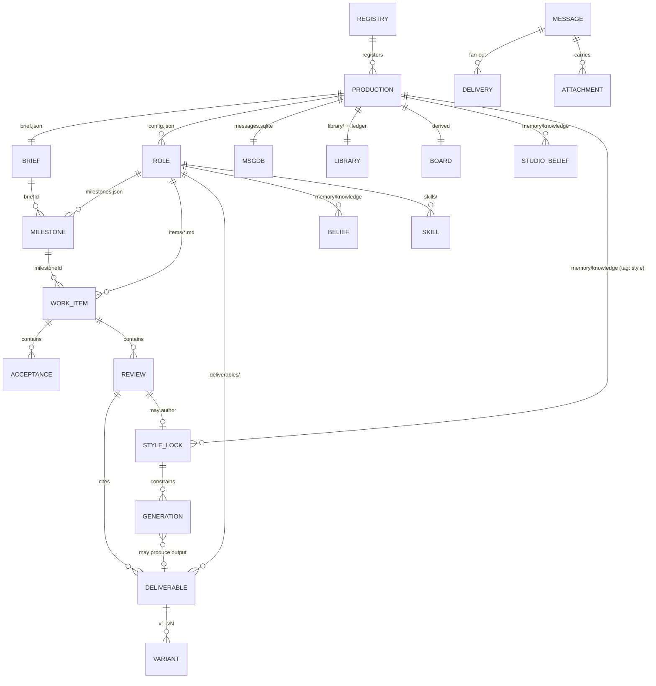

# shotgun-next · Data Model

Every durable entity. Adapted from [docs/04-data-model.md](../docs/04-data-model.md).

---

## 1. Entities



## 2. Brief — `brief.json`

The direction layer. Written only by the Director, and only with the user's confirmation for
meaning changes.

```ts
{
  version: 1, updatedAt,
  brief: {
    briefId: string
    title: string
    client?: string
    audience: string            // who it is for
    message: string             // the one thing it must land
    deliverables: string[]      // what is being made, in the user's words
    constraints: string[]       // format, length, platform, budget, legal
    references: AssetRef[]      // what "good" looks like
    successSignal: string       // how we will know it worked
    status: "draft"|"active"|"blocked"|"delivered"|"cancelled"
    deadline?: ISO
    health?: "on_track"|"at_risk"|"blocked"|"done" | null
    riskSummary?: string | null
    lastDeliveryAt?: ISO | null
  }
}
```

`audience` / `message` / `successSignal` are required and they are the studio equivalent of
Matrix's *"Tell the team who it serves, what should get better, and what signal proves it got
better. Without that, agents merely stay busy."*

## 3. Milestone — `roles/<id>/milestones.json`

Owned by exactly one role, stored in that role's file.

```ts
{
  milestoneId: string
  briefId: string
  ownerRoleId: string           // MUST equal the store it lives in
  title: string
  doneState: string             // what "proved" looks like, in observable terms
  status: "draft"|"active"|"at_risk"|"blocked"|"accepted"|"cancelled"
  priority: "low"|"normal"|"high"
  deadline?: ISO | null
  effortSize?: "quick"|"deep" | null    // deep ⇒ must break into Work Items first
  dependsOn?: string[]
  progress?: number             // 0..1; 0..100 accepted and normalized
  health?, confidence?, blockers?, nextAction?
  deliverableRefs?: string[]
  learningRefs?: string[]
  appendDeliverableRefs?, appendLearningRefs?     // merge, don't replace
}
```

## 4. Work Item — `roles/<id>/items/<itemId>.md`

```markdown
---
itemId: item-launch-film-style-directions
kind: make | review | research | org_change
status: pending
title: Three style directions for the 30s launch film
briefId: brief-botanical-launch
milestoneId: milestone-locked-look
ownerRoleId: b3f1a290
priority: high
createdAt: 2026-09-16T09:00:00.000Z
updatedAt: 2026-09-16T09:00:00.000Z
---
## Brief
What to make and why it matters now.

## Trigger
{ "type": "manual" | "time" | "role_message", "reason": "…" }

## Acceptance
- [open] A1: Three distinct directions, each with 4+ frames and a one-line rationale.
- [open] A2: Each direction names its palette, lens language and grade.
- [satisfied] A3: References cleared for mood-board use.
  - deliverable: library/refs/clearance-2026-09-16.md

## References
library/refs/board-competitors.md
memory/knowledge/style-botanical-restraint.md

## Next Action
## Deliverables
## Learning Refs
## Reviews
[ { …Review… } ]
```

### Enums

```ts
ITEM_STATUS       = pending | scheduled | dispatched | making | review_pending
                  | blocked | accepted | rejected | cancelled
TRIGGER_TYPE      = manual | time | role_message
ACCEPTANCE_STATUS = open | satisfied | blocked | not_applicable
REVIEW_VERDICT    = accept | revise | reject
MILESTONE_DECISION= accept | modify | reject
LEARNING_DECISION = ignore | deliverable-only | style-lock | memory-card | skill-update | next-item
BLOCKER_CATEGORY  = input_missing | role_waiting | tool_failure | rights_or_access
                  | creative_blocker | budget
```

**Only the authorized review/control path writes `accepted | rejected | blocked | cancelled`.** `item.upsert` may set
`pending | scheduled | dispatched | making | review_pending` and nothing else.

## 5. Review

```ts
{
  reviewId: "review-<yyyymmddhhmmssSSS>-<n>"
  kind: "quality" | "user_acceptance" | "control"
  actor: { type: "role" | "user" | "system", id: string } // daemon-derived, never trusted input
  authorRoleId?: string          // derived for role actors
  reviewedRevisionId: string     // exact immutable artifact version
  reviewedAt: ISO
  verdict?: "accept" | "revise" | "reject" // required for quality/user acceptance, absent for control
  status: ItemStatus
  judgment: string               // one line: what was judged, against what
  requiredFixes?: Array<{ severity: "blocking"|"major"|"minor", note: string }>
  nextAction: string
  blockerCategory?: BlockerCategory       // required when status = blocked | rejected
  deliverableRefs: string[]
  learningRefs: string[]
  milestoneDecision?: "accept"|"modify"|"reject"   // required for milestone-linked items
  milestoneState?: MilestonePatch                  // required when decision = modify
  learningDecision: LearningDecision
  acceptance?: Array<{id, text, status, deliverableRefs, notes?}>   // merged by id
}
```

`requiredFixes` with severity is the studio's version of Matrix's blockers — it is what turns
"this isn't working" into something a maker can act on.

The Critic may append a quality review for an assigned peer item but cannot edit its production fields. A Critic pass leaves `review_pending`; human acceptance of the same revision may set `accepted`. `revise` returns the item to `making`; `reject` closes that attempt. Owners may record blockers/cancellation via control records, never manufacture quality acceptance. Artifact or criteria changes invalidate old acceptance for the new revision. Commit decisions through one authoritative store.

## 6. Deliverable & variants

```ts
Deliverable {
  deliverableId: string
  itemId: string
  roleId: string
  kind: "image"|"video"|"audio"|"document"|"board"|"package"
  variants: Variant[]            // v1..vN
  chosenVariantId?: string
  path: string                   // roles/<id>/deliverables/<slug>/
}
Variant {
  variantId: "v1"
  path: string
  generation?: GenerationRef     // prompt, model, seed, references, style lock
  createdAt: ISO
  note?: string
}
```

**Variants are first-class.** In Matrix a file has revisions; in a studio a deliverable has
*alternatives*, and choosing between them is the work. Do not model them as revisions.

## 7. Style lock — the studio's distinctive entity

A belief card with `tag: style`, promoted to a typed record:

```ts
StyleLock {
  lockId: string
  name: string                   // "Botanical restraint"
  authoredBy: roleId
  authoredIn: reviewId           // provenance: which verdict created it
  scope: "production" | "milestone" | "role"
  palette?: string[]             // hex
  typography?: string[]
  lensLanguage?: string
  grade?: string
  positivePrompt?: string        // appended to generations
  negativePrompt?: string
  references: AssetRef[]
  avoid: string[]
  status: "active" | "superseded"
  supersededBy?: lockId
}
```

Every generation records which locks applied. This is how "your one sentence of taste becomes
durable state" actually works, and it is the mechanism that makes the studio feel like it learns.

## 8. Message bus — `messages.sqlite`

Matrix's schema, renamed. Keep every CHECK constraint.

```sql
CREATE TABLE messages (
  seq INTEGER PRIMARY KEY AUTOINCREMENT,
  id TEXT UNIQUE NOT NULL CHECK (length(trim(id)) > 0),
  root_id TEXT NOT NULL,
  reply_to_id TEXT REFERENCES messages(id),
  kind TEXT NOT NULL CHECK (kind IN ('assignment','comment','delivery')),
  from_role TEXT NOT NULL,
  topic TEXT,
  message TEXT NOT NULL CHECK (length(trim(message)) > 0),
  outcome TEXT CHECK (outcome IS NULL OR outcome IN ('completed','failed','cancelled')),
  dedupe_key TEXT UNIQUE,
  created_at TEXT NOT NULL,
  causal_relation_to_user TEXT CHECK (causal_relation_to_user IS NULL OR causal_relation_to_user IN (
      'directInstruction','delegatedFromUser','userImport','agentAutonomous',
      'scheduled','systemMaintenance','externalUnknown')),
  causal_role_ids_json TEXT, causal_item_ids_json TEXT,
  source_session_id TEXT, source_turn_id TEXT,
  source_trigger_message_id TEXT, root_user_message_id TEXT, initiating_user_id TEXT,
  CHECK (kind <> 'assignment' OR reply_to_id IS NULL),
  CHECK (outcome IS NULL OR kind = 'delivery')
);
-- deliveries(message_id, to_role, wake_state, wake_attempts, last_wake_at, last_error)
-- attachments(message_id, position, uri, name, mime, size, sha256)
```

Vocabulary: `assignment` opens work · `comment` adds silent context · `delivery` + `outcome`
closes it.

## 9. Memory

```
memory/knowledge/<slug>.md
---
title: …
tag: self | aspire | style | taste
confidence: H | M | L
created: YYYY-MM-DD
planned: [slug-a]
status: hint | candidate | emerged | routed | retired
---
Decision: …
Why: …
Rejected: …
Reverse if: …
See also [[other-slug]].
```

`tag: taste` cards are injected into **every creative seat's prompt** (not retrieved on demand) —
they are small, they are load-bearing, and forgetting them is the failure the user notices most.

## 10. Library & provenance ledger

```
library/
├── refs/          user-supplied and researched references
├── generated/     generation outputs (by production, not by role)
├── incoming/      client drops, uploads
├── packages/      publish packages
└── .ledger        provenance
```

Ledger events, extending Matrix's model:

```
metadata · revision · mutation · access · lineage · collaboration
+ variant      v1..vN of a deliverable
+ approval     who accepted what, when, with which verdict
+ source       which references, prompt, model, seed and style locks produced a generated asset
```

`source` is captured **by the generation tool**, never reported by the agent.

## 11. Board projection — `board.json`

```ts
{ version: 1, updatedAt,
  refresh: { frequency, enabled, status, lastRunAt, nextRunAt, lastError? },
  hero: { title, summary, metrics: [{id,label,value,detail}] },
  columns: [{ id, title, kind, sourceRefs: string[], cards: […] }] }
```

Columns: **Needs your eye · In review · In production · Blocked · Scheduled · Delivered.**
Every card carries `sourceRefs` (`role:<id>`, `item:<id>`, `message:<id>`, `deliverable:<id>`).

Derived. Agents never write it. The narrative pass may fail; the deterministic aggregation still
renders.
