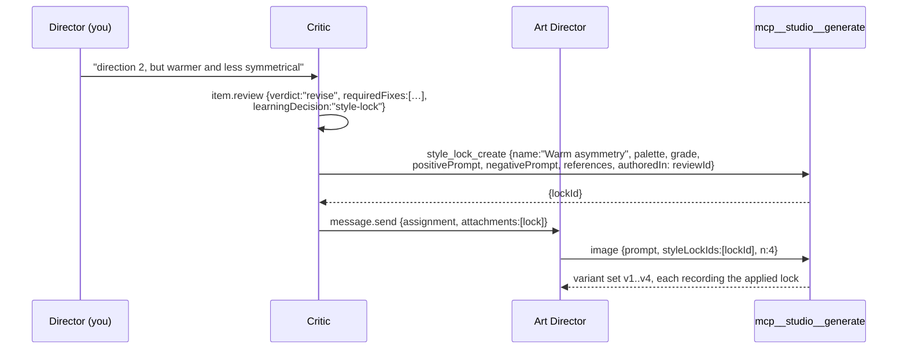

# shotgun-next · Tool Surface

Every tool a role agent gets. Adapted from [tools/](../tools/); descriptions written in the
Receivable voice ([T06](../tools/T06-mcp-receivable.md)).

---

## 1. MCP servers

| Server | Tools | Always load | Notes |
|---|---|---|---|
| `studio` | `role` | yes | coordination + role CRUD |
| `studio` | `state` | yes | Brief / Milestone / Work Item / Review |
| `studio` | `schedule` | yes | time triggers bound to Work Items |
| `studio` | `provenance` | yes | library ledger queries |
| `studio` | `generate` | yes | image / video / audio / variants / style locks |
| `studio` | `browser` | if enabled | script + delegated visual step |
| `<provider>` | `search`, `execute` | per connection | Figma, Drive, Notion, Frame.io, … |

---

## 2. `mcp__studio__role`

Actions:

```
COLLAB (all roles)
  message.send · message.reply · message.queue · message.thread
  chat.read_recent · chat.search
  user_profile.get · user_profile.update
  role.list · role.get

DIRECTOR ONLY
  role.create · role.update · role.delete
```

Description skeleton (following T01):

> Roles are seats. Each owns a craft with its own memory, skills, Work Items, references, and
> coordination history.
>
> The Director has two scopes: studio operator for the Brief, the map, routing and shared
> references; and seat owner for its own Milestones, Work Items, deliverables, memory and
> continuity with the director. Specialist seats own bounded craft execution.
>
> Workers are same-seat execution hands inside one role. Cross-seat work routes through role
> messages.
>
> Message kind expresses intent: `assignment` opens work, `comment` adds silent context to a
> thread, `delivery`+`outcome` closes work.
>
> Role message bodies are stored losslessly. Substantial deliverables land as files in the
> library, with a concise summary in the message and the path in attachments.
>
> `role.list` returns each seat's charter, craft domains and taste — use it to see whose craft a
> piece of work falls under.

Minimal contracts:

```
message.send     : action, message, toRole, topic?, attachments?
message.reply    : action, messageId, message, outcome, attachments?
message.reply(note): action, messageId, kind="comment", message
message.queue    : role?
message.thread   : messageId, includeBodyFor?
role.create      : name, craft, profile?          (Director)
role.update      : role, name?/craft?/profile?/lifecycle?/model?/proactive?
role.delete      : role, confirmRoleId
```

Same guards as Matrix: unknown-field rejection with a teaching message, placeholder/empty-string
normalization, per-action field relevance filtering, and a `next` hint on every result.

---

## 3. `mcp__studio__state`

The single write surface for direction, progress and judgment.

```
SPECIALIST   state.get · milestone.create · milestone.update · milestone.state_patch
             item.upsert · item.review
DIRECTOR     + brief.create · brief.update · brief.state_patch
```

Key schema points (full shapes in [03-data-model](03-data-model.md)):

```ts
{
  action, role?, briefId?, milestoneId?, itemId?
  brief?: { title, audience, message, deliverables[], constraints[], references[],
            successSignal, status, deadline?, health?, riskSummary? }
  milestone?: { briefId, ownerRoleId, title, doneState, status, priority,
                deadline?, effortSize?, dependsOn?, progress?, … }
  milestonePatch?: { status?, progress?, health?, blockers?, confidence?, nextAction?,
                     deliverableRefs?, learningRefs?,
                     appendDeliverableRefs?, appendLearningRefs? }
  item?: { itemId?, title, briefId?, milestoneId?, ownerRoleId, kind,
           status (non-terminal only), priority?, nextAction?,
           trigger?, acceptance[], references[], deliverableRefs?, learningRefs? }
  review?: { kind, verdict?, status, reviewedRevisionId, judgment, requiredFixes[], nextAction,
             blockerCategory?, acceptance[] (merged by id),
             deliverableRefs[], learningRefs[],
             milestoneDecision?, milestoneState?, learningDecision }
}
```

Invariants (all inherited, all worth keeping):

| Invariant | Enforcement |
|---|---|
| Only the Director writes the Brief | `requirePrimary()` |
| Peer mutation is scoped | ordinary edits require ownership; the assigned Critic may append a quality review only |
| Milestones live in their owner's store | write-path validation |
| Terminal item states only via `item.review` | status enum on `item.upsert` |
| `satisfied` acceptance carries a deliverable ref | required when `status="satisfied"` |
| Milestone-linked reviews decide the milestone | explicit decision and permitted patch; no completion before required final acceptance |
| Learning refs must exist on disk first | `learningDecision` + existence check |
| **A maker cannot accept its own work** | daemon-derived actor must match assigned `criticRoleId` for quality review; final acceptance belongs to authenticated user |
| Reviews cannot drop acceptance items | merge-by-id semantics |

The last two are the studio-specific additions and they are the ones that make the output
trustworthy.

---

## 4. `mcp__studio__schedule`

```
action: create | update | delete | list
itemId       required for create — the Work Item this wakes
schedule     5-field cron in local time, or "5m" / "1h"
recurring    false = one-shot
activeHours  { start:"09:00", end:"19:00" }  (crosses midnight if end < start)
enabled      false pauses without deleting
purpose      follow_up | monitor | deadline | review | render_check | publish_window
sourceRefs   why this trigger exists
```

> Time wakes must attach to a Work Item and never be free-floating reminders.

Built-in `CronCreate/Delete/List` are disallowed, exactly as in Matrix.

---

## 5. `mcp__studio__provenance`

```
metadata.get · history.list · access.list · lineage.get · revision.diff · revision.restore
variant.list · approval.list · source.list
```

`source.list` answers the studio's real provenance question: *which references, prompt, model,
seed and style locks produced this frame.*

Keep all three anti-hallucination clauses:

> redacted history must not be guessed or reconstructed ·
> never invent actor or causal fields ·
> restore requires reading `currentRevisionID` first and asking the exact confirmation question
> the tool returns

Plus `expectedCurrentRevisionID` (optimistic guard) and `operationID` (idempotent retry).

---

## 6. `mcp__studio__generate`

The centre of gravity. Extends Matrix's media tools ([T05](../tools/T05-mcp-media.md)).

| Tool | Purpose |
|---|---|
| `image` | text → image |
| `image_edit` | restyle / remove / recolor / cleanup / masked edit (normalized `selection`) |
| `video` | prompt / frames / reference / character modes |
| `video_status` | poll or download |
| `audio` | music, speech, voice cloning (`@Audio1..3`), ambience, Foley, SFX |
| `character_register` / `character_list` | consistent `@people` across shots |
| `style_lock_create` | turn a review verdict into a durable lock |
| `style_lock_apply` | apply named locks to a generation |
| `variant_set_create` | group n generations as v1..vN of one deliverable |
| `variant_select` | mark the chosen variant; the rest stay as history |
| `cost_estimate` | predicted spend for a batch, before it runs |

Carried-over conventions, all of them load-bearing:

```
output    relative to roles/<id>/deliverables/<slug>/ — automatic provenance + usable as a ref
sizing    aspect/tier tokens (16:9, 16:9@2K, 1:1, 9:16), never arbitrary pixels
masking   normalized selection rect → provider mask built IN MEMORY, no temp files
modes     mutually exclusive; Matrix states this in prose — shotgun-next may encode it as a
          discriminated union / refinement in the shared schema (see T05 §4) and keep the prose
arrays    "Native JSON array; do not stringify it."
async     explicit async object → operation receipt; provider and durable item IDs kept separate
defaults  stated in every field description
```

### Style lock flow



---

## 7. `mcp__studio__browser`

Two tools, unchanged in shape from [T07](../tools/T07-mcp-matrix-browser.md):

```
browser_script_run     persistent JS VM; globals agent, display, console
browser_task_message   delegate ONE bounded visual step
```

Changes from Matrix:

- **Per-role browser profiles** — research and publishing seats do not share cookies.
- **Per-site policy** with an explicit "acting as you on `<site>`" confirmation for authenticated
  actions.
- Keep the absent-API list and the platform warnings verbatim.

---

## 8. Built-in tools

```
Files        Read · Write · Edit · Glob · Grep
Execution    Bash · Monitor
Delegation   Agent · TaskOutput · TaskStop · SendMessage
Scratch      TodoWrite
Planning     EnterPlanMode · ExitPlanMode
Web          WebFetch · WebSearch
Discovery    Skill · ToolSearch
User         AskUserQuestion

Disallowed   CronCreate · CronDelete · CronList
             + any write to tool-owned state (enforced by path policy, not prompt)
```

Dropped from Matrix's set: `PowerShell`, `LSP`, `TeamCreate/Delete`, `EnterWorktree/ExitWorktree`,
`TaskCreate/Get/Update/List`.

### `Agent` description — keep the argument

Copy Matrix's runtime-routing reasoning wholesale
([T09](../tools/T09-builtin-agent-tools.md#agent--the-delegation-tool)), including:

- default native; escalate only with a **named concrete benefit for this specific task**
- the three context modes (`task` / `recent` / `fork`)
- **don't peek** (never read a background worker's transcript mid-flight)
- **don't race** (never fabricate or predict a worker's result)
- *"brief the agent like a smart colleague who just walked into the room"*
- treat outputs as **evidence-carrying drafts**
- parallel workers go in **one message with multiple tool blocks**

---

## 9. Web / external data ladder

Injected into every prompt, unchanged:

```
known URL / article / doc / API-shaped data ......... WebFetch
open-ended lookup, current facts, comparisons ....... WebSearch
structured data from a service ...................... its API / CLI / SDK via Bash
only-a-real-browser-can-do-it ....................... studio browser
```

> "Don't open a browser just to read information a fetch, search, or API call would have
> returned."

---

## 10. Tool description template

Every shotgun-next tool description follows the Receivable pattern:

```
You are the director's interpreter for <capability>. They are making something; they don't know
what <jargon> is and they shouldn't have to. Listen for what they are trying to accomplish,
decide which arguments to set, and ask plainly when something is missing.

They will say things like "<real phrasing>" — they will not say "<API verb>".

<one paragraph explaining the domain in their terms>

The field that matters is `<field>` — the rest is explainability.

<enum> drives the user-facing answer:
  <value> — <what to tell them>

Do not invent <domain> facts: if this returns nothing, say so plainly. An empty result means
<benign explanation>, not <scary misreading>.
```
