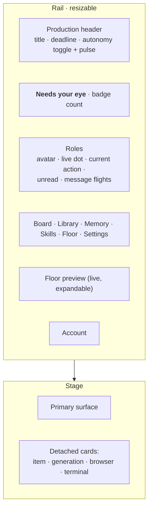
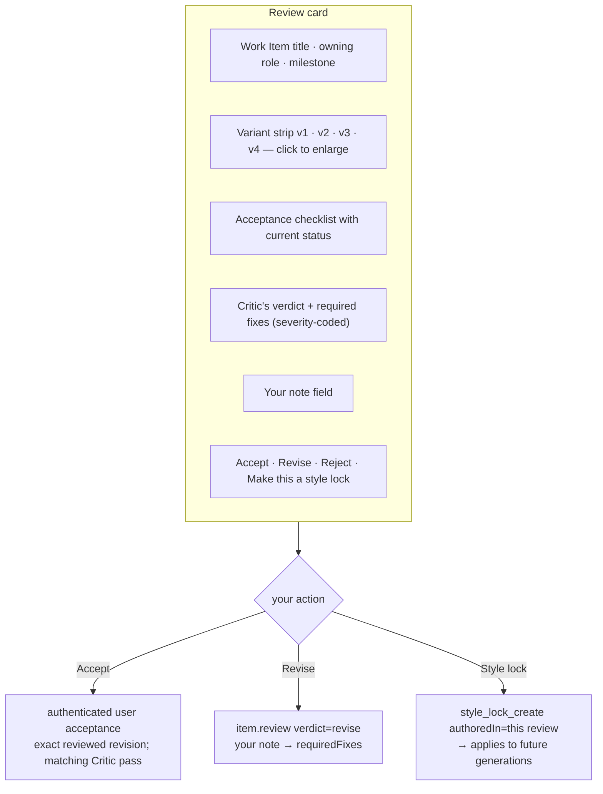
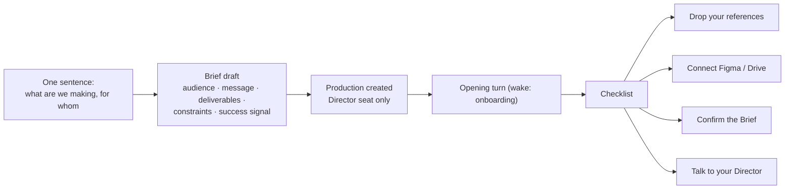

# shotgun-next · UI Specification

Adapted from [docs/07-ui-architecture.md](../docs/07-ui-architecture.md).

---

## 1. Shell



Three deliberate differences from Matrix:

1. **"Needs your eye" is pinned at the top of the rail**, above the roles. In a studio the
   review queue *is* the user's job.
2. **Each role row shows its current action in words** ("drafting v3", "waiting on refs",
   "reviewing"), not just a dot. Cheap, and it is what makes eight concurrent agents legible.
3. **The floor preview is proposed to be live by default.** Matrix's resources suggest this pattern; it is intended as an ambient signal
   that the studio is alive.

## 2. Surfaces

| Surface | Answers | Primary component |
|---|---|---|
| **Chat** | "talk to a seat" | per-role conversation + side panel |
| **Review queue** | "what needs my judgment" | stacked review cards with verdict actions |
| **Board** | "what is everyone making" | column-per-role Kanban |
| **Library** | "where did this come from" | asset grid + provenance + variant sets |
| **Memory & Skills** | "what does the studio know" | book-shelf catalog + editors |
| **Floor** | "show me the studio" | 3D room |
| **Settings** | models, seats, integrations | panes |

## 3. Review queue — the signature surface



**"Make this a style lock" is the single most important button in the product.** It is the moment
a taste call stops being a chat message and becomes durable state. Put it one click away from
every verdict.

## 4. Chat

- Native markdown streaming with parse cache + reveal gates (Matrix's approach — do not
  re-parse per delta).
- **Visual annotation**: drag a box on an image in the conversation → becomes a normalized
  `selection` rect for `image_edit`, with no temp files. This is Matrix's best UI↔tool bridge.
- **Reference drop**: dropping a file attaches it *and* registers it in the library with
  provenance.
- **Queued input, steerable**: you can queue several messages and redirect one before it runs.
- **Seat routing in the composer**: `@writer`, `@art-director`, `@critic` are hard assignments.
- Dictation is an available control; microphone capture starts only after an explicit user action and OS permission.

## 5. Board

Column per role; cards are Work Items; live worker rows beneath. A **loose column** holds
unowned work. Grouping switchable by role / milestone / status.

Inspectors drill Brief → Milestone → Work Item → deliverables → the review thread that judged
them. `WorkMessageEvidenceSheet`'s equivalent: clicking a deliverable ref opens the role-message
thread that delivered it.

## 6. Library

Adapted from Matrix's Files module, with two studio additions:

- **Variant sets rendered as sets**, not as a flat list of files, with the chosen variant marked.
- **Source card** per generated asset: prompt, model, seed, references, style locks applied —
  from `source.list`.

Keep from Matrix: the **collaboration table** (which seats touched a file, when, how), column /
grid / list views, drag-drop at three levels, two-phase trash, and chunked upload.

## 7. Memory & Skills

Keep Matrix's library metaphor — belief cards and skills rendered as books with generated covers.
It transforms "a folder of Markdown" into "the studio's knowledge", and it makes the user
actually open and edit them.

Add a **Taste** shelf: `tag: taste` and `tag: style` cards, shown separately because they are
prompt-resident and therefore the highest-leverage thing the user can edit.

## 8. Stage cards

```
item · generation · browser · terminal
```

Long-running work detaches into cards you can spread out. Generation cards show live progress
from the hook and land the result in place.

## 9. Autonomy UI

- A **pulse** in the production header while lanes are active.
- A **hover card** on any autonomous action: *why this woke*, *which reason*, *what it did*.
- A **decision log** (`nudge.decisions.list`) so quiet periods are explicable —
  "cooling down after quiet checks" beats silence.
- Every card traceable via `sourceRefs`.

> Autonomy is only tolerable if it is legible. Matrix learned this; ship it from v1.

## 10. Rendering strategy

| Content | Renderer |
|---|---|
| chat, cards, board | native (SwiftUI or React) with streaming gates |
| documents, rich transcripts | one WebView (markdown + KaTeX + highlight) |
| canvas / mood boards | tldraw in the same WebView |
| images / video | platform media views + thumbnail cache |
| floor | 3D engine (R3F or RealityKit) |

Four renderers was right for Matrix; three is enough here.

## 11. Persistence

Versioned, production-scoped keys:

```
shotgun.WindowRestore.ActiveProductionID.v1
shotgun.WindowRestore.RailSelection.v1        e.g. "role:b3f1a290"
shotgun.SelectedRoleIDsByProduction.v1
shotgun.RailModuleBadgeSeen.v1
shotgun.ComposerRoutingPreferences.v1
shotgun.Onboarding.v1.<uuid>
```

Typed selection strings make deep links (`shotgun://`) and restoration trivial.

## 12. Onboarding



Specialist seats are created on demand. The Critic must exist before a gated item enters review; missing reviewer availability parks the review visibly. Final user approval is distinct from the Critic's assessment.
