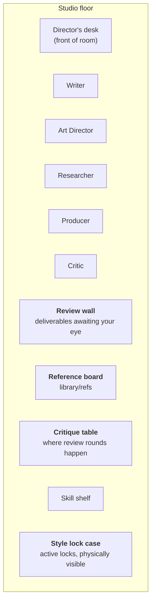
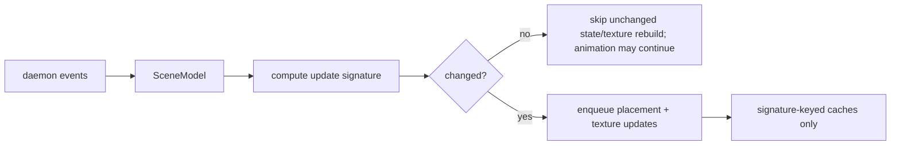

# shotgun-next · Studio Floor (3D)

Adapted from [docs/08-office-3d-world.md](../docs/08-office-3d-world.md) and
[M29](../modules/M29-office-renderer.md). **Build the behaviour, buy the renderer.**

---

## 1. What it is

One room, not a city. A stylised studio floor where each seat has a desk, deliverables hang on a
review wall, references live on a board, and critique happens at a table.



## 2. Entity mapping

| Domain | Scene |
|---|---|
| Role | a desk + a character + a nameplate |
| Role working | character at desk, monitor shows its live output |
| Role blocked | character idle, a visible blocker marker |
| Work Item in `review_pending` | the deliverable appears on the **review wall** |
| Critique round | characters gather at the **critique table** |
| Role message | a pulse travelling desk-to-desk |
| Style lock | an object in the **lock case**; superseded locks fade |
| Reference | a pinned card on the reference board |
| Generation running | a progress artefact at the owning desk |
| Delivered | the deliverable moves from wall to an archive shelf |

**The review wall is the product idea.** It gives "what needs my judgment" a physical location
you can walk to — which is exactly the thing a flat list of notifications fails to do.

## 3. Sync architecture — copy this exactly



Sub-signatures (one per expensive thing):

```
sceneSignature            overall
roleScreenSignature       a role's live monitor content
reviewWallSignature       what is hanging and where
styleCaseSignature        active locks
deskAllocationKey         which seat sits where
nameplateKey              role name rendering
```

Measure frame time, texture upload cost and idle power after implementation; neither code size nor a 60 fps result follows from the symbol inventory.

## 4. Behaviour layer (build this)

```
RoleSceneState        idle · making · reviewing · blocked · waiting · delivering
RoleSceneAction       walk · sit · stand · present · hand-off · react
Navigation            waypoints, travel mode, seat allocation
Conversation          who is talking to whom, focus
CritiqueRound         who attends, what is on the table, the verdict moment
Reaction              click a character → reaction + sound
Persona               mood / energy / traits — DISPLAY ONLY, never in the prompt
```

Matrix's `agent_minds.<ws>.json` pattern: persist persona per character, drive idle behaviour and
reactions, and keep it strictly out of the model's context.

## 5. Renderer — buy it

| Option | When |
|---|---|
| **React Three Fiber** (+ three-vrm, drei) | cross-platform, web-capable client — **default choice** |
| **RealityKit / SceneKit** | native macOS/iOS only, want system-grade quality cheaply |
| **Godot embedded** | want a real engine and tooling, accept the integration cost |

Using an engine is the previous author's proposed scope reduction. Matrix's symbol counts do not establish engineering months or free equivalence. The user's request includes exterior fidelity, so validate the proposed engine against a reference-scene comparison before adopting it; native rendering remains an option.

What you must still build: the entity mapping, the behaviour layer, the signature gate, live
content as texture, and 2D overlay projection from 3D anchors.

## 6. Live content as texture

The one genuinely hard piece worth keeping:

```
role monitor      ← last N lines of that role's output / current tool
review wall       ← deliverable thumbnails, with acceptance state
reference board   ← library/refs thumbnails
style lock case   ← palette swatches + a representative frame
critique table    ← the item under review
```

Each is a texture regenerated **only when its signature changes**.

## 7. Modes

```
Overview   orbit the floor — the default
Desk       sit at one seat, read its monitor full-size
Wall       stand at the review wall; verdict actions available in-world
Present    cinematic pass for showing a client
```

Skip first-person, photo mode and multiplayer for v1. They are delightful and they are not why
anyone buys this.

## 8. Effort budget

| Piece | Effort | Notes |
|---|---|---|
| Room + desks + props | 1–2 wk | asset sourcing dominates |
| Character rig + idle/walk/sit | 1 wk | VRM + three-vrm, or simple stylised rigs |
| Behaviour state machine | 2 wk | **the product** |
| Signature gate + caches | 3 days | high payoff |
| Live textures | 1 wk | |
| Overlay projection | 3 days | |
| Modes + camera | 1 wk | |

The rows sum to **36–41 engineer-days (7.2–8.2 five-day weeks)** before integration and contingency. This is an estimate for the reduced room, not Matrix-level visual/interaction parity or evidence of Matrix's development time.

## 9. Ship it late, design it early

The floor should be **phase 4** ([08-build-plan](08-build-plan.md)), but the **event taxonomy
must support it from phase 1**. That means: every role state change, every item transition, and
every review must emit a discrete event with a stable id. If you build the daemon's event stream
correctly, the floor is a consumer, not a rewrite.
