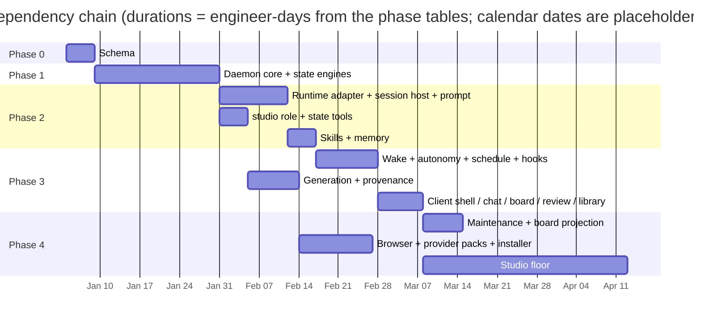

# shotgun-next · Build Plan

Provisional work breakdown, not a 15-week delivery commitment. Rows measure engineer-days; calendar duration depends on staffing, dependencies, runtime choice, visual fidelity and acceptance work. No recovered source project makes the engine or native UI free to rebuild.

---

## Phase 0 · Schema first (5 engineer-days, provisional)

**Deliverable:** one package that everything else derives from.

```
packages/schema/
├── entities.ts      Production · Role · Brief · Milestone · WorkItem · Review · Deliverable
│                    Variant · StyleLock · Message · Asset · Hook · Schedule
├── protocol.ts      every method: name, params, result, and every event
├── enums.ts         the closed vocabularies
└── generate.ts      → daemon validators · client types · docs
```

A shared schema reduces contract drift. The 259 Hub-prefixed symbols do not prove manual DTO authoring, and no measured time saving is available.

**Exit criteria:** `pnpm generate` emits daemon validators and client types; a round-trip test
passes for every method.

---

## Phase 1 · Daemon core + state engines (22 engineer-days, provisional)

| Piece | Days | Reference |
|---|---|---|
| Process lifecycle: preflight → bind → reconcile → reap → serve → drain | 3 | [M01](../modules/M01-harness-daemon-core.md) |
| Loopback bind guard + owner lease + status.json | 1 | runtime spec §2.2 |
| Production store, scaffolding, migrations, `.env` | 3 | [M02](../modules/M02-workspace-store.md) |
| Role registry with `profile` + `collaborationBoundary` + `taste` | 3 | [M03](../modules/M03-department-registry.md) |
| Brief/Milestone engine (two-store split, owner invariant) | 3 | [M04](../modules/M04-okr-engine.md) |
| Work Item engine (Markdown packets, acceptance, terminal-state monopoly) | 4 | [M05](../modules/M05-task-engine.md) |
| Message bus (SQLite, CHECK constraints, deliveries, causality) | 3 | [M06](../modules/M06-department-messaging.md) |
| Transactional state and process write-isolation prototype | 2 | [Implementation contracts](10-implementation-contracts.md) |

**Exit criteria:** a CLI can create a production, create roles, write a Brief, dispatch a message
between two roles, and close it with an outcome — with no LLM involved.

---

## Phase 2 · Agent sessions + tools (22 engineer-days, runtime-dependent)

| Piece | Days | Reference |
|---|---|---|
| Runtime adapter interface + native implementation | 4 | [M07](../modules/M07-session-host.md) |
| Session host: state, quiet policy, watchdogs, retries, ordered pump | 4 | [M07](../modules/M07-session-host.md) |
| Prompt assembly: static prefix / volatile tail, hot-key refresh | 4 | [M08](../modules/M08-prompt-assembly.md) |
| `mcp__studio__role` | 2 | [T01](../tools/T01-mcp-matrix-department.md) |
| `mcp__studio__state` | 3 | [T02](../tools/T02-mcp-okr-state.md) |
| Skills: scopes, overlay mount, seed set, `seedVersion` | 3 | [M15](../modules/M15-skills-system.md) |
| Memory: belief cards, index, taste cards, global profile | 2 | [M14](../modules/M14-memory-system.md) |

**Exit criteria:** the Director accepts a one-sentence brief, creates a second role, dispatches to
it, receives a delivery, and files a review — end to end, in one session.

This is the **riskiest phase**. If the ownership model doesn't hold here, nothing later saves it.

---

## Phase 3 · Autonomy, generation, client (28 engineer-days, provisional)

| Piece | Days | Reference |
|---|---|---|
| Wake engine: reasons, mutex, coalescing, audit | 3 | [M09](../modules/M09-wake-engine.md) |
| Autonomy lanes, next-step order, activity gate, decision log | 3 | [M10](../modules/M10-autonomy-nudge.md) |
| Schedule (Work-Item-bound), ticker/runner split, injectable clock | 2 | [M11](../modules/M11-cron-scheduler.md) |
| Hooks/WorkRuns + async generation completion | 3 | [M12](../modules/M12-hooks-workruns.md) |
| `mcp__studio__generate` incl. variants + style locks | 5 | [T05](../tools/T05-mcp-media.md) |
| Provenance ledger + host-side capture + `source.list` | 4 | [M16](../modules/M16-file-service-provenance.md) |
| Client shell, chat, board, review queue, library | 8 | [06-ui-spec](06-ui-spec.md) |

**Exit criteria:** you brief a film, three roles produce, the Critic reviews, you accept a variant
and create a style lock from your note, and the next generation inherits it — without touching a
terminal.

---

## Phase 4 · Depth (56–61 engineer-days, provisional)

| Piece | Days |
|---|---|
| Maintenance / crystallize + taste extraction + style-lock consolidation | 4 |
| Board projection (deterministic + narrative pass with graceful failure) | 3 |
| Browser tools + per-role profiles + site policy | 4 |
| Provider packs: Figma, Drive, Notion, Frame.io | 5 |
| Runtime installer + external runtimes + billing modes | 4 |
| Studio floor (3D), matching the detailed floor estimate | 36–41 |

---

## Phase 5 · Polish (ongoing)

Onboarding, the guide, role templates, voice dictation, export/publish packaging, sync.

---

## Critical path



Bar lengths are the same engineer-day figures as the phase tables (5 + 22 + 22 + 28 + 56 = 133
at the low bound); the start date is arbitrary and the chart shows only ordering, not a plan.

The detailed rows total **133–138 engineer-days**, roughly **26.6–27.6 engineer-weeks**, before Phase 5, contingency and any custom agent-engine work. Parallel staffing does not linearly remove dependencies. The original 15-week total and 10-day floor allocation were inconsistent with the floor's own breakdown. The illustrative dependency chart is not a dated commitment; validate estimates after the runtime/isolation/fidelity prototypes.

---

## Risk register

| Risk | Likelihood | Mitigation |
|---|---|---|
| The Director hoards work despite the prompt | **high** | make it structural: log every self-executed item that matched an existing seat's craft, and surface it on the board as "unrouted work" |
| Prompt cache churn destroys the cost model | high | assert in tests that `instructions` is byte-stable across two consecutive builds with unchanged config |
| Style locks proliferate and contradict | medium | consolidation pass in crystallize; `supersededBy`; show active locks in the UI, in-world in the lock case |
| Generation cost surprises the user | medium | `cost_estimate` before batches; budget per milestone; cost as a *secondary* board metric |
| Agents mark work accepted without review | medium | authenticated assigned reviewer, exact revision binding, separate human acceptance |
| Variant explosion buries the chosen take | medium | `chosenVariantId` is required before an item can be accepted |
| 3D scope creep | **high** | buy the renderer; ship the floor in phase 4; cut first-person/photo/multiplayer |
| Rights/licensing on references | medium | Researcher's charter includes clearance; rights notes are a deliverable type |

---

## Test strategy (copy Matrix's instincts)

1. **Prompt-content tests** — pin the assembled `instructions` for a fixture production; any
   diff must be intentional.
2. **Init-shape tests** — scaffolding is idempotent and produces exactly the expected tree.
3. **Managed-write guards** — test shell, external workers, symlink/hard-link aliases, rename/unlink and downloads as well as Write/Edit against canonical state.
4. **State-machine tests** — every illegal transition (`item.upsert` → `accepted`, a maker
   accepting its own work, a milestone in the wrong store) is rejected.
5. **Injectable clock** — a bench mode with a clock socket so schedule and decay are testable.
6. **Round-trip protocol tests** — generated from the schema package.

Matrix's own maintenance checklist names the exact surfaces that must be updated together when
the model changes. Write that checklist for shotgun-next on day one:

> Runtime prompt · agent-facing contract (`studio-schema.md`) · skills · tool contracts ·
> init/repair · derived views · tests that pin prompt content, init shape, managed-write guards,
> and item/milestone behaviour.
