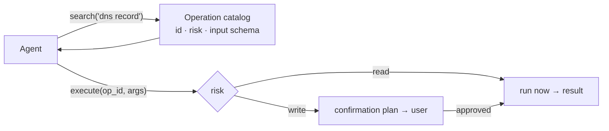

# T08 · Provider Packs — `mcp__<provider>__{search,execute}`

**Servers:** `cloudflare` (first-class) + one per connected native integration provider

A uniform two-tool shape for every third-party service.

---

## `search`

> Search the connected Matrix `<Provider>` app pack operation catalog.
>
> Returns operation ids, risk levels, and input schemas. **Use before `execute` when parameters
> are uncertain.**
>
> This is the first-class `<Provider>` pack surface; **do not route `<Provider>` through the
> generic integrations skill.**

## `execute`

> Execute a connected Matrix `<Provider>` operation by `operation_id`.
>
> **Read operations execute immediately** through Matrix auth. **Write operations return a Matrix
> confirmation plan** instead of applying changes directly.
>
> Never ask for `<Provider>` tokens. Do not expose account ids, resource ids, tokens, or raw
> credentials in the final user-facing answer.

---

## Why this shape



Three properties fall out:

1. **Context cost is O(1) per provider**, not O(operations). A provider with 300 operations still
   costs two tool definitions.
2. **Risk is data**, attached to each operation, so the write gate is declarative.
3. **Credentials never enter the model's context** — auth happens inside Matrix.

Compare with the alternative (one MCP tool per operation), which is what most integrations do and
which does not scale past a handful of providers.

## Read-only allowlist

The runtime ships an explicit allowlist of read-only operation names across many integrations —
Supabase (`get_advisors`, `list_edge_functions`, `get_project_url`…), Stripe
(`retrieve_balance`, `list_customers`, `list_payment_intents`…), PubMed, BigQuery
(`bigquery_query`, `get_table_info`…), Firecrawl, Exa, Perplexity, Tavily, Obsidian, Figma
(`get_figma_data`, `download_figma_images`), MongoDB, Neo4j, Elasticsearch, Airtable, Puppeteer,
and the `browser_*` read surface.

That runtime classification is separate from native pack authorization. The pack handler reads the gateway catalog's `risk`; only `risk === "read"` chooses execute, and other/missing values choose plan. An operation's presence in a runtime name list does not authorize a pack write.

## Cloudflare specialisation

`cloudflare` gets a dedicated MCP module with provider operation IDs, not direct daemon RPC endpoints:

```
cloudflare.accounts.list · zones.list
cloudflare.dns.records.list / .upsert / .delete
cloudflare.pages.projects.list · workers.services.list
cloudflare.registrar.domains.check / .search
```

…and a full integration pack with 9 skills (`cloudflare`, `wrangler`, `workers-best-practices`,
`durable-objects`, `agents-sdk`, `sandbox-sdk`, `building-mcp-server-on-cloudflare`,
`building-ai-agent-on-cloudflare`, `web-perf`), 2 slash commands, `.mcp.json`, a Codex plugin
manifest and assets.

That is what "first-class integration" means here: **tools + skills + commands + assets shipped
together.**

## shotgun-next mapping

Adopt the shape verbatim. First providers for a creative studio:

| Provider | Why |
|---|---|
| Figma | design source of truth |
| Google Drive / Dropbox | asset exchange with clients |
| Notion | briefs and specs |
| Frame.io | review and approval |
| YouTube / Instagram / TikTok | publishing |
| Slack | client and team comms |

Ship each as a pack (tools + skills + commands + assets), with `search`/`execute`, risk levels on
every operation, and a read-only allowlist.
